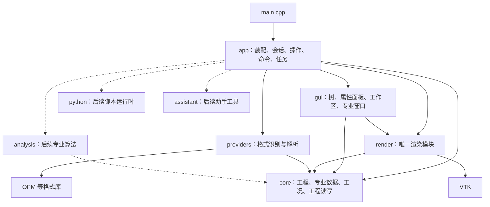
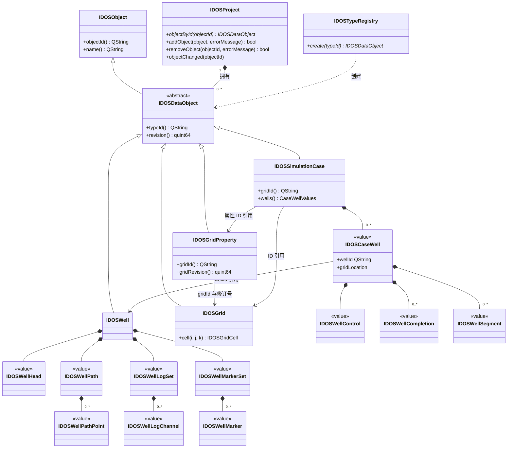
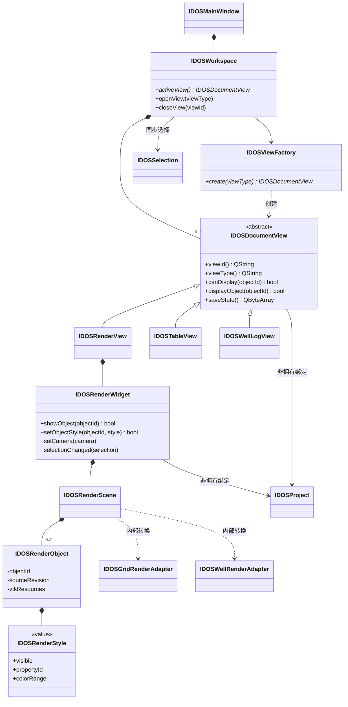
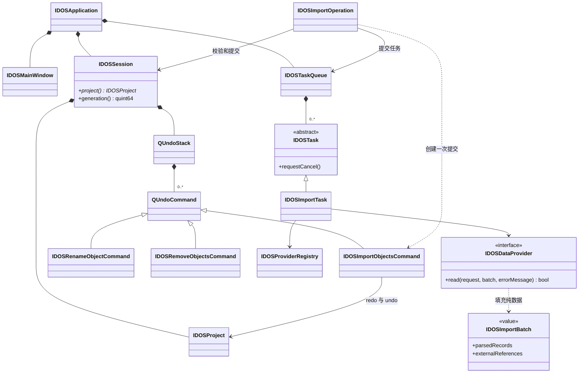
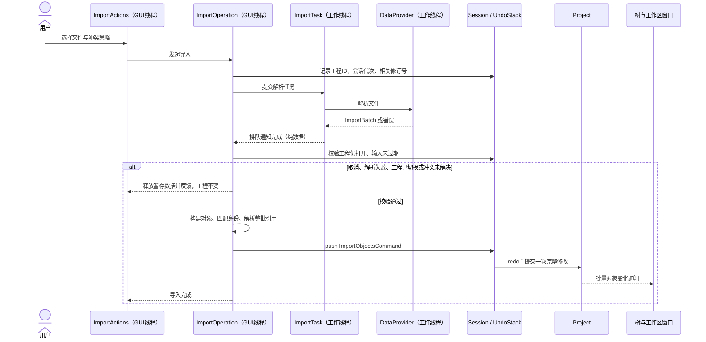
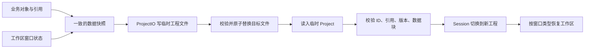

# IDOS UML 与架构图

适用：`D:\CMakeCoder\IDOS`。2026-09-22，目标设计，不是当前源码自动生成图。

配套：[目录与类文件组织](IDOS-目录与类文件组织.md) · [架构设计方案](IDOS-架构设计方案.md)。

以下采用 Mermaid。模块图是依赖图；类图和时序图表达 UML 关系。实心菱形表示生命周期所有权，普通关联和带说明箭头表示引用/使用，不代表复制数据。各图为分视角表达，省略 Qt 基类及部分成员。

## 1. 模块依赖图

箭头表示“依赖/调用”，不是对象变化通知方向。仅绘制主要直接依赖；App 的装配依赖还包括 Core 和 Render 公共类型。

Python/Assistant 不反向链接 App。App 在装配时向它们注册回调或其公共接口的实现，避免双向模块依赖。Render 内部包含 adapters，不另建渲染适配模块。

## 2. 领域对象 UML 类图

井和网格是 Project 的独立对象。工况的井配置按值持有，不能通过 QObject parent 把共享井改挂到工况。曲线通道第一版是井内部值数据；视图定位使用井 ID 加持久化子记录键，不将可编辑的显示名当永久键。

图中的 `revision` 用于变化检测和缓存失效，不代表已经实现可回溯版本仓库。第一版方案隔离采用显式派生对象，未来的运行复现另需保存输入快照。

## 3. 窗口与渲染 UML 类图

上图的组合表示逻辑生命周期所有权，具体 QObject 使用 Qt 父子关系，非 QObject 使用 RAII。存在异步销毁风险的非拥有 QObject 引用使用 QPointer。

每个 RenderWidget 创建自己的 RenderScene 和样式；不同窗口引用同一业务对象时，不共享可变 Actor 或样式。可在后续共享不可变几何缓存。GUI 的 IDOSRenderView 是工作区窗口，不是第二套渲染实现。

## 4. 应用会话、导入与命令 UML 类图

Provider 的 request 表示路径、取消与进度上下文的设计占位，具体接口在后台导入实现时收敛。纯数据包不携带工程、窗口或跨线程 QObject 指针。

## 5. 后台导入 UML 时序图

主线程不得等待工作线程完成解析。构建对象只做轻量封装，昂贵转换和大数组处理在后台完成；提交阶段使用移动/共享不可变块降低复制。发生提交失败时整批回退，不能留下半个工况。

## 6. 保存与恢复流程图

Core 只把窗口状态视为有版本的不透明字节数据，不认识 QWidget。未知窗口类型可以跳过并提示；未知业务对象类型不能静默丢弃后保存覆盖原工程。
