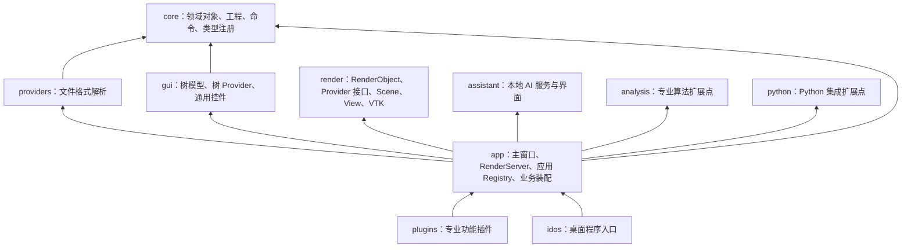
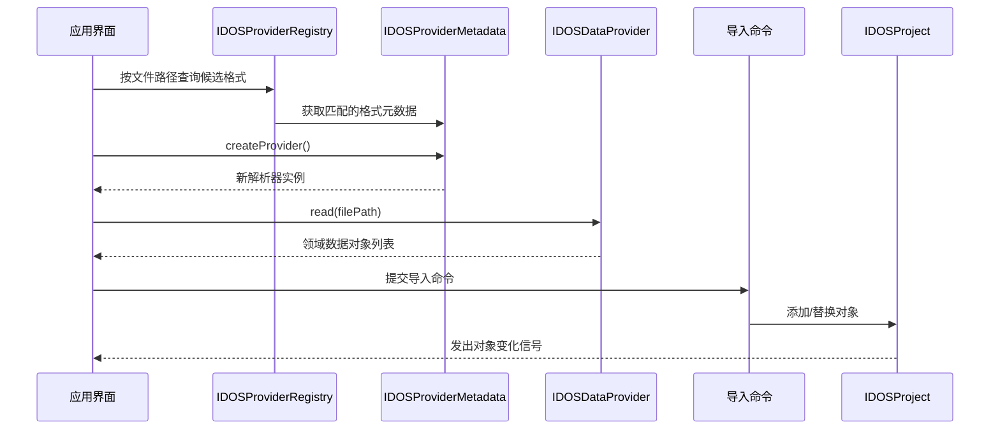
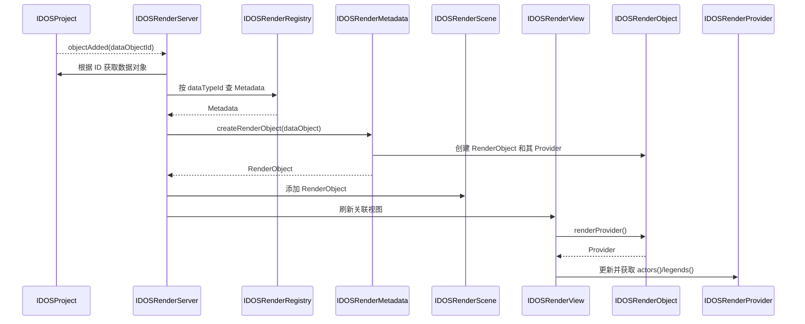

# IDOS 架构设计

> 本文说明 IDOS 的模块边界、核心对象关系和扩展流程。渲染部分以已确认的目标架构为准；若现有代码与本文不一致，应按本文收敛实现，不以旧实现反向改变设计。

## 1. 设计目标与原则

IDOS 是面向油气储层数值模拟前处理的桌面应用，负责工程数据组织、数据导入、模型管理、交互式 3D 可视化以及专业功能扩展。

架构遵循以下原则：

- **面向接口**：模块之间通过稳定接口协作，调用方不依赖具体数据类型或渲染实现。
- **依赖单向**：领域模型不依赖界面、插件或渲染；应用装配层组合各模块。
- **数据与显示分离**：工程数据对象是业务数据的唯一来源；树节点和渲染对象是按需建立的展示对象。
- **所有权明确**：工程持有数据对象，注册表持有元数据，渲染对象持有自己的 Provider，场景持有渲染对象。
- **ID 分层**：数据对象 ID 与渲染对象 ID 是不同概念，各自唯一，通过 Provider 和服务层维护关联，不要求两个 ID 相同。
- **扩展走同一通道**：内置功能与插件通过同一组注册接口接入，不依赖插件 DLL 的加载先后决定功能顺序。

## 2. 模块分层



| 模块 | 职责 | 不应承担的职责 |
|---|---|---|
| `core` | 数据对象、工程、命令与撤销重做、对象类型元数据和注册 | 文件格式解析、界面展示、VTK 渲染、插件 UI |
| `providers` | 将文件解析为领域数据对象，维护文件格式元数据和解析器注册表 | 直接操作工程 UI、维护树节点或渲染对象 |
| `gui` | 数据树/工况树的模型、视图、树 Provider 注册与通用控件 | 持有业务数据副本、执行数据解析或直接创建 VTK actor |
| `render` | 通用渲染对象和 Provider 接口、Scene、View、VTK 交互 | 工程事件同步、业务类型分派和 Ribbon/停靠 UI |
| `app` | 主窗口和服务装配；连接工程、树、渲染及插件接口 | 将具体业务类型的渲染规则塞进通用 View/Scene |
| `plugins` | 通过应用接口注册专业 Ribbon 页面和功能 | 修改应用内部对象或依赖其他插件的加载顺序 |
| `assistant` | 本地模型进程、请求服务和助手 UI | 管理工程数据结构或渲染场景 |
| `analysis` | 专业算法扩展模块 | 界面、导入解析、渲染和应用流程编排 |
| `python` | Python 集成扩展模块 | 领域模型的重复实现 |

### 2.1 依赖规则

- `core` 是领域基础模块，不引用 `gui`、`render`、`app` 或插件模块。
- `providers` 和 `gui` 面向 `core` 的稳定接口工作；`render` 不依赖应用数据类型，由应用适配层将领域数据接入渲染接口。
- `app` 是组合根：创建服务、连接信号、将各模块装配成桌面应用。
- 专业插件依赖公开的应用接口；插件之间不直接互相调用。
- VTK 依赖限制在 `render` 及需要实现具体渲染 Provider 的适配代码中。
- `tools/check_includes.ps1` 用于检查源码 include 边界；新增依赖必须符合上述方向。

## 3. 核心领域模型

### 3.1 工程与数据对象

`IDOSProject` 是工程数据对象的根容器，按对象 ID 管理并持有 `IDOSDataObject`。工程对象通常包括井、网格、属性场、工况等。

数据对象通过稳定的类型 ID 描述自身类型；`IDOSTypeRegistry` 保存类型元数据，并支持按类型创建领域对象。输入数据和模型对象通过 `IDOSObjectCategory` 区分，以决定其在数据树或模型树中的归属。

工程通过信号发布对象新增、移除、业务数据变化和可见性变化。批量更新期间，工程收集变化并在事务结束后发送批量信号，避免导入大量对象时重复刷新界面。

### 3.2 工况引用

工况可以引用已有网格、属性场等对象。引用保存对象 ID，而不是复制业务数据。树模型可在不同上下文展示同一个领域对象；因此树节点 ID、对象 ID 和渲染对象 ID 不应混为一谈。

### 3.3 命令与撤销重做

工程修改通过 `IDOSCommandManager` 和 `QUndoStack` 管理。命令负责校验、执行和撤销具体操作；应用入口根据用户操作创建或调用命令。命令元数据可描述可执行命令及其参数 schema，供应用层调用。

## 4. 数据导入与类型扩展

文件导入链路由格式元数据、解析器和应用命令共同完成：



- `IDOSProviderMetadata` 描述稳定格式 ID、显示名称、扩展名、格式检测和解析器创建。
- `IDOSDataProvider` 执行一次具体解析；解析器有状态，每次导入创建新实例。
- 解析器返回领域对象，不直接拥有或修改 `IDOSProject`；对象归并、校验和提交由应用命令负责。
- `IDOSProviderRegistry` 按格式 ID 或文件路径查找元数据，并生成文件选择器过滤器。

## 5. 树视图架构

输入数据树和工况/模型树是对工程对象的不同投影，不是各自维护一份业务数据。

- 树 Model 管理节点与 Qt Model/View 索引，响应工程变化并维护增量更新。
- Tree Provider 按数据类型提供节点构建、显示信息和菜单能力。
- `IDOSTreeProviderRegistry` 根据类型 ID 查找对应 Tree Provider。
- 工况树可通过对象 ID 展示工况内的网格、属性等引用；一个对象可以在不同工况上下文中有不同树节点。
- 树选中状态由应用层协调。渲染视图的上下文和当前活动视图可以决定对应的树定位；树选中本身不应被误认为工程数据变化。

## 6. 渲染架构（目标设计）

渲染链路限定为 **Registry → Metadata → RenderObject → RenderProvider → Scene/View**，工程信号由 **RenderServer** 直接处理。

### 6.1 组件职责

| 组件 | 职责 |
|---|---|
| `IDOSRenderRegistry` | 注册和查找渲染元数据，按数据类型 ID 分派 |
| `IDOSRenderMetadata` | 描述所支持的数据类型，并根据数据对象创建对应的 `IDOSRenderObject` |
| `IDOSRenderObject` | 保存渲染对象自身 ID/名称，持有 Provider，并通过公开的 `renderProvider()` 返回 Provider |
| `IDOSRenderProvider` | 为所属渲染对象提供通用渲染操作；创建时接收并关联源数据对象指针，不拥有源数据对象 |
| `IDOSRenderScene` | 持有和管理渲染对象；不连接工程信号，也不负责业务类型判断 |
| `IDOSRenderView` | 从 Scene 获取渲染对象，通过 Provider 获取 actor、图例等；处理视图交互和 actor 拾取 |
| `IDOSRenderServer` | 连接工程信号；使用 Registry/Metadata 创建、更新、移除渲染对象；协调 Scene、View 和活动视图状态 |

### 6.2 对象与 ID

- 数据对象由工程持有，使用自己的数据对象 ID。
- 渲染对象由 Scene 持有，使用独立的渲染对象 ID；渲染 ID 不复用数据对象 ID。
- 一个渲染对象可以生成多个 actor。View 在拾取时先将 actor 解析为其所属渲染对象，再通过该对象 Provider 找到关联源数据。
- Provider 对源数据对象保存非拥有指针；其生命周期不得超过工程中源数据对象的生命周期。Server 收到对象移除信号时，应先移除对应渲染对象。

### 6.3 典型调用流程



对象数据变化、可见性变化和移除同样由 RenderServer 根据工程信号处理。该逻辑不放入 Metadata 或 Provider；不设置 `IDOSRenderProviderContext`、变更枚举或 Provider `synchronize()` 回调层。

### 6.4 边界与复用

`render` 提供通用渲染接口和视图/场景能力；应用数据类型的元数据与具体 Provider 由适配层实现。其他软件可以复用通用渲染接口，并为自己的数据对象实现 Metadata 和 Provider，而无需复用 IDOS 的树、工程窗口或业务插件。

## 7. 插件架构

插件由 `IDOSPluginRegistry` 发现和管理，通过 `QLibrary` 加载动态库。插件实现 `IDOSPlugin` 接口，并导出创建、卸载和元数据查询等 C-linkage 函数。插件元数据包括名称、描述、分类、版本、图标和类型。

插件通过 `IDOSInterface` / `IDOSAppInterface` 使用受支持的主窗口能力，例如查询或创建 Ribbon 页面。插件初始化时注册 UI；卸载时移除自己创建的 UI 并释放资源。Ribbon 页面顺序应由显式索引或应用约定决定，不能依赖插件文件枚举或加载顺序。

插件可以扩展专业 UI 和业务行为。若要扩展数据类型、文件格式、树节点或渲染，应使用相应注册接口；不应通过跨插件硬编码依赖实现扩展。

## 8. 主窗口与应用装配

`IDOSMainWindow` 是桌面应用的组合根，负责创建并连接：

- SARibbon 工具栏和插件接口；
- ADS 停靠管理器、数据树、工况树、输出面板与渲染视图；
- `IDOSProject`、命令管理器、Provider 注册表和 RenderServer；
- 工程信号、树交互、视图交互与工具栏状态。

主窗口负责协调 UI 状态，不应直接实现具体网格/井的 VTK 构造细节。活动视图变化、方向标记/图例显示、视图上下文与树定位等状态，由 RenderServer 发信号，主窗口连接并更新 UI。

## 9. 生命周期与所有权

```text
IDOSProject
└── owns IDOSDataObject instances

IDOSProviderRegistry
└── owns IDOSProviderMetadata instances

IDOSRenderRegistry
└── owns IDOSRenderMetadata instances

IDOSRenderScene
└── owns IDOSRenderObject instances
    └── owns IDOSRenderProvider instance
        └── keeps non-owning association to source data object

IDOSMainWindow / ADS
└── owns or coordinates widgets, dock widgets and render views
```

对象销毁顺序必须保证：先移除引用源数据的渲染对象，再销毁工程数据对象；卸载渲染元数据前，先移除由其创建且仍在 Scene 中的对象。

## 10. 横切约定

- 用户可见文案通过 `tr()` 和翻译文件维护。
- 工程修改统一通过命令/工程接口，避免 UI、Tree Provider 或 Render Provider 直接绕过工程对象管理。
- 批量操作使用工程批量更新信号减少重复刷新；不在每个对象更新后重复重建整个 UI。
- 跨模块接口放在所属模块的公共头文件中，禁止用具体实现头文件反向制造依赖。
- C++ 风格、头文件自包含、构建目录和架构检查按仓库根目录 `AGENTS.md` 执行。

## 11. 当前实现与设计的差距

本节用于提醒维护者：设计边界与现存代码不一致时，应修正实现，不应把历史兼容层当作新的架构约定。

渲染实现仍需收敛到第 6 节。以下模式不属于目标架构：

- 用 `IDOSRenderProviderContext` 让 Provider 访问工程和 Scene；
- 用 `IDOSRenderObjectChange` 和 `synchronize()` 将工程事件同步委托给 Provider；
- 用 `IDOSDataRenderProvider` 作为 `IDOSRenderProvider` 的额外包装/派生层；
- 由 RenderServer 或 View 持有一个全局 VTK 转换器，再按渲染对象类型转换 actor；
- 将网格属性、井轨迹等具体数据类型操作放入通用渲染服务接口。

后续重构应先梳理工程信号到 Scene/View 的完整调用链，再一次性调整接口和实现；不要在旧机制上叠加适配层。
